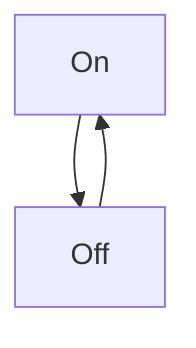
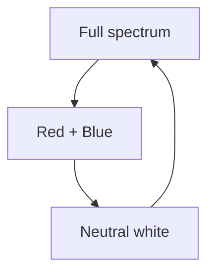
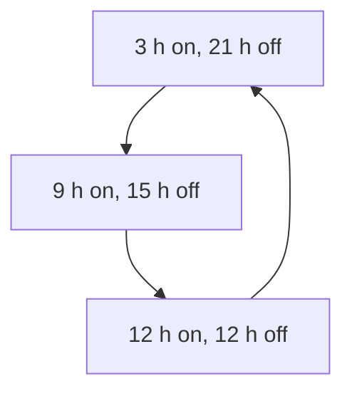
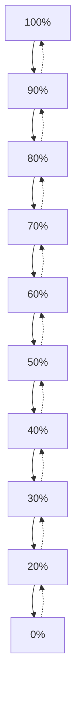

# ESPHome-Smart-Plant-Light

## Short description

This repository is used to host config and build instructions of a DIY [ESPHome](https://esphome.io/) smart plant light with soil moisture level sensor. The purpose is to have theability to
1) control moisture level, 
2) remote control of the plant light,
3) from within your local [Home Assistant](https://www.home-assistant.io/) instance.

## Hardware used to assembly the appliance

- [Waveshare ESP32-S3 Mini](https://www.waveshare.com/esp32-s3-zero.htm)  

- [Grove capacitive soil moisture meter](https://wiki.seeedstudio.com/Grove-Capacitive_Moisture_Sensor-Corrosion-Resistant/)  

- [Cheap generic plant lamp](https://pl.aliexpress.com/item/1005007970872476.html?spm=a2g0o.productlist.main.33.7fca6Slh6Slhwz&algo_pvid=532ca2c2-ea43-450b-bed2-b29b270a7dc6&algo_exp_id=532ca2c2-ea43-450b-bed2-b29b270a7dc6-32&pdp_ext_f=%7B%22order%22%3A%2221%22%2C%22eval%22%3A%221%22%2C%22fromPage%22%3A%22search%22%7D&pdp_npi=6%40dis%21PLN%2177.28%2148.10%21%21%21147.81%2192.00%21%40211b816617593596407335338ec3c0%2112000043087948416%21sea%21PL%210%21ABX%211%210%21n_tag%3A-29910%3Bd%3A8ce32871%3Bm03_new_user%3A-29895%3BpisId%3A5000000174217209&curPageLogUid=aZW0sXelt6v0&utparam-url=scene%3Asearch%7Cquery_from%3A%7Cx_object_id%3A1005007970872476%7C_p_origin_prod%3A)  

- [Grove connection wire with female headers](https://www.seeedstudio.com/Grove-4-pin-Female-Jumper-to-Grove-4-pin-Conversion-Cable-5-PCs-per-PAck.html)

- Some basic wires with female and male connectors

##  Connection tables

Bellow you'll find connection tables describing the cable connections between the lamp, Waveshare board itself and the analog moisture sensor.

### Table 1: Moisture sensor - Waveshare board

| Connection Id | Sensor Pin | Board Pin |
|---------------|------------|-----------|
| 1             | VCC        | 3V3       |
| 2             | GND        | GND       |
| 3             | SIG        | GP6       |

### Table 2: Lamp contrrol board - Waveshare board

| Connection Id | Lamp switch control pad | Board Pin |
|---------------|-------------------------|-----------|
| 1             | ON / OFF                | GP1       |
| 2             | Timer                   | GP2       |
| 3             | Color                   | GP4       |
| 4             | Light intensity         | GP5       |

## Lamp control logic

Controlling over the lamp functions is orgininaly done by pushing some small button. Each push changes states of a function withing a closed set of values organised in looped sequences. You can see them on the diagrams visible bellow.

### Light

### Light color

### Timer mode

### Light intensity

First it dims down and than it goes up higher on the same steps

